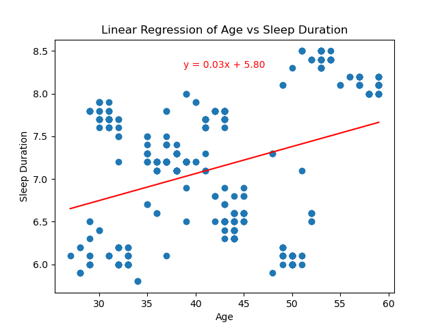

# Sleep vs Lifestyle Patterns & Factors

**Overview**
Sleep plays a crucial role in our overall health and well-being, yet many individuals struggle with getting enough sleep. We analyze the intricate relationship between professions, stress levels, lifestyle factors, and sleep patterns to uncover key insights into the factors influencing sleep quality and duration. Data analysis of various professions is used to identify what is most likely to disrupt the sleeping experience disorders, the impact of sleep disorders on sleep duration and investigate how stress levels, profession, and lifestyle choices influence sleep patterns. This study aims to contribute valuable insights that can inform strategies for improving sleep health and overall well-being among individuals in various professions and lifestyle choices. This project was colaborated on with Shaina Joseph, Julia McKinnon, and Ernesto Garcia.

**Relationship Between Stress Levels and Sleep Duration Variablility**
* Question: What is the relationship between stress and sleep duration?
* Findings: Strong linear relationship between the two with the higher your stress levels are the lower your sleep duration is. The r squared in this regression is 0.6578 which is quite high and suggests a strong correlation between the two.

**Relationship Between Stress Levels and Sleep Quality Duration**
* Question: What is the relationship between stress levels and sleep quality?
* Findings: Lower stress levels correlate with higher quality of sleep and longer sleep duration. The r squared on this linear regression is 0.8078 which is even higher, suggesting an even stronger relationship between stress and quality of sleep than stress and duration of sleep. 

**Nurses, Salespeople, and Teachers Likely to Have Sleeping Disorders**
* Question:Which professions are most likely to have sleeping disorders?
* Findings: Nurses, salespeople, and teachers are identified as the professions most likely to have sleeping disorders.

**Stress Levels and Sleep Duration Among All Professions**
* Question: Which profession has the highest stress levels and how does that relate to sleep duration?
* Findings: Sales representatives and salespeople have the highest stress levels and the lowest sleep duration.

**Relationship between age and sleep**
* Question: What, if any, is the correlation between sleep and age?
* Findings: There is a weak positive correlation between getting older and getting more sleep. A p-value of 7.1171395312160525e-12 shows little probability of correlating.

**Impact of Gender on Sleep**
* Question: Is there a difference between gender and sleep duration?
* Findings: Females sleep longer than males. Only by a small margin. This is supported further researcher stating women sleep longer than men by about 12 minutes(Healthline, 2024)

**Correlation Between Coffee, Tea, and Sleep Duration**
* Question: How do caffeinated beverages affect sleep?
* Findings: Coffee consumption correlates with low sleep duration(5.5 hours), while tea alone seems to have no significant effect on sleep duration(7.07) compared to the average(7.01). However, when consumed together, tea appears to slightly negate the negative effects of coffee on sleep duration(6.37). 

